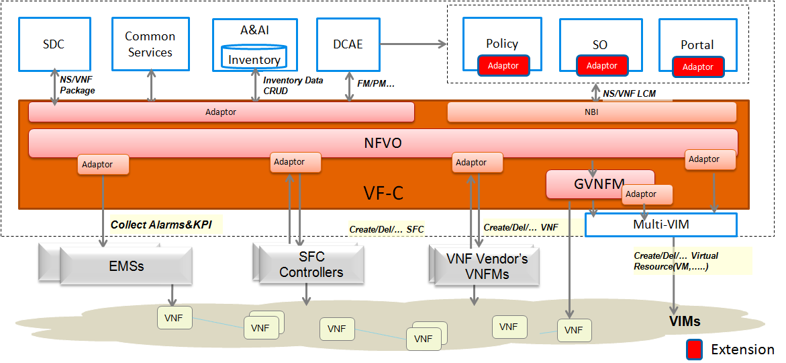

.. This work is licensed under a Creative Commons Attribution 4.0 International License.
.. http://creativecommons.org/licenses/by/4.0

VF-C Architecture
-----------------
Following is the VF-C architecture.

|image0|

   
VF-C includes two components: NFVO and GVNFM

VF-C has many dependencies with other projects,such as SO,Policy,A&AI,SDC,DCAE,Multi-cloud and so on.