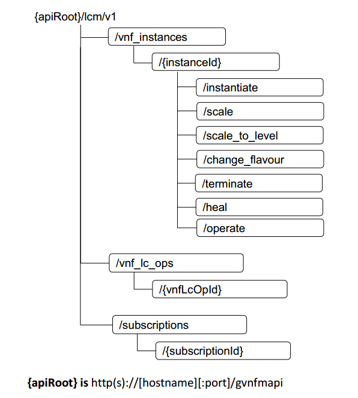

.. contents::
   :depth: 3
..

   **GVNFM Northbound & Southbound APIs**
   **V0.1**

**1 Scope**
=============

The scope of the this document is to describe the GVNFM exposed API specification over Or-Vnfm reference point and Ve-Vnfm-vnf reference point.
Some content has been updated, about the API Swagger definition, you can find here 'GVNFM_LCM_APIs<https://gerrit.onap.org/r/gitweb?p=vfc/gvnfm/vnflcm.git;a=blob;f=lcm/lcm/swagger/swagger.json;h=f098d282927d3535f5e9e6950f26b9171e04d30c;hb=HEAD>'.

**2 Terms, Definitions and Abbreviations**
===========================================

 For the purpose of the present document, the following
 abbreviations apply:

+------------------------+-----------------------------------------------------+
|     **Abbreviation**   |                                                     |
+========================+=====================================================+
|     NFVO               |     Network Functions Virtualization Orchestrator   |
+------------------------+-----------------------------------------------------+
|     VNFM               |     Virtual Network Function Manager                |
+------------------------+-----------------------------------------------------+
|     VNF                |     Virtual Network Function                        |
+------------------------+-----------------------------------------------------+

Table 2-1 abbreviations

**3. Interfaces provided by GVNFM**  (Or-Vnfm) 
==========================================================

   Interfaces use RESTful API and the format is as follows:
   http(s)://[hostname][:port]/api/vnflcm/v1/[……]

|image0|

    **{apiRoot} is** http(s)://[hostname][:port]/api

**3.1 Create VNF Identifier**
-----------------------------

+---------------------+--------------------------------------------------------------+
|     If Definition   | Description                                                  |
+=====================+==============================================================+
|     URI             | http(s)://[hostname][:port]/api/vnflcm/v1/vnf\_instances     |
+---------------------+--------------------------------------------------------------+
|     Operation       | POST                                                         |
+---------------------+--------------------------------------------------------------+
|     Direction       | NFVO->VNFMLCM                                                |
+---------------------+--------------------------------------------------------------+

**3.1.1 Request**

+---------------------------+-------------+---------------+------------------+-------------------------------------------------------------------------------------+
| Parameter                 | Qualifier   | Cardinality   |     Content      | Description                                                                         |
+===========================+=============+===============+==================+=====================================================================================+
| vnfdId                    | M           | 1             |     Identifier   | Identifier that identifies the VNFD which defines the VNF instance to be created.   |
+---------------------------+-------------+---------------+------------------+-------------------------------------------------------------------------------------+
| vnfInstanceName           | M           | 1             |     String       | Human-readable name of the VNF instance to be created.                              |
+---------------------------+-------------+---------------+------------------+-------------------------------------------------------------------------------------+
| vnfInstanceDescription    | O           | 0..1          |     String       | Human-readable description of the VNF instance to be created.                       |
+---------------------------+-------------+---------------+------------------+-------------------------------------------------------------------------------------+

    {
      "vnfdId": "zte\_vFW\_51610", 
      "vnfInstanceName": "vFW\_01",
      "vnfInstanceDescription": " vFW in Nanjing TIC Edge"

    }

**3.1.2 Response**

+-----------------+-------------+---------------+------------------+-----------------------------------------+
| Parameter       | Qualifier   | Cardinality   |     Content      | Description                             |
+=================+=============+===============+==================+=========================================+
| vnfInstanceId   | M           | 1             |     Identifier   | VNF instance identifier just created.   |
+-----------------+-------------+---------------+------------------+-----------------------------------------+

    {
      "vnfInstanceId": "1"

    }

**3.1.3 Response Code**

+-----------+-----------------------+-----------------------------------------------------------+
| Code      | Meaning               |     Description                                           |
+===========+=======================+===========================================================+
| 201       | Created               |     A VNF Instance identifier was created successfully.   |
+-----------+-----------------------+-----------------------------------------------------------+
| 4xx/5xx   | <name from RFC7231>   |     <description>                                         |
+-----------+-----------------------+-----------------------------------------------------------+

**3.2 Delete VNF Identifier**
-----------------------------

+---------------------+------------------------------------------------------------------------------+
|     If Definition   | Description                                                                  |
+=====================+==============================================================================+
|     URI             | http(s)://[hostname][:port]/api/vnflcm/v1/vnf\_instances/{vnfInstanceId}     |
+---------------------+------------------------------------------------------------------------------+
|     Operation       | DELETE                                                                       |
+---------------------+------------------------------------------------------------------------------+
|     Direction       | NFVO->VNFMLCM                                                                |
+---------------------+------------------------------------------------------------------------------+

**3.2.1 Request**

+-------------+-------------+---------------+---------------+---------------+
| Parameter   | Qualifier   | Cardinality   |     Content   | Description   |
+=============+=============+===============+===============+===============+
| n/a         |             |               |               |               |
+-------------+-------------+---------------+---------------+---------------+

**3.2.2 Response**

+-------------+-------------+---------------+---------------+---------------+
| Parameter   | Qualifier   | Cardinality   |     Content   | Description   |
+=============+=============+===============+===============+===============+
| n/a         |             |               |               |               |
+-------------+-------------+---------------+---------------+---------------+

**3.2.3 Response Code**

+--------+-----------+-------------------+
| Code   | Meaning   |     Description   |
+--------+-----------+-------------------+

+-----------+-----------------------+----------------------------------------------------------------------------------------------+
| 204       | No Content            |     The VNF instance resource and the associated VNF identifier were deleted successfully.   |
+===========+=======================+==============================================================================================+
| 4xx/5xx   | <name from RFC7231>   |     <description>                                                                            |
+-----------+-----------------------+----------------------------------------------------------------------------------------------+

**3.3 Instantiate VNF**
-----------------------

+---------------------+-------------------------------------------------------------------------------------------+
|     If Definition   | Description                                                                               |
+=====================+===========================================================================================+
|     URI             | http(s)://[hostname][:port]/api/vnflcm/v1/vnf_instances/{vnfInstanceId}/instantiate       |
+---------------------+-------------------------------------------------------------------------------------------+
|     Operation       | POST                                                                                      |
+---------------------+-------------------------------------------------------------------------------------------+
|     Direction       | NFVO->VNFMLCM                                                                             |
+---------------------+-------------------------------------------------------------------------------------------+

3.3.1 **Request**

+--------------------+-----------+-------------+---------------------+---------------------------------------------------------------+
| Parameter          | Qualifier | Cardinality | Content             | Description                                                   |
+====================+===========+=============+=====================+===============================================================+
| flavourId          | M         | 1           | IdentifierInV nfd   | Identifier of the VNF deployment flavour to be instantiated.  |
+--------------------+-----------+-------------+---------------------+---------------------------------------------------------------+
| instantiation      | O         | 0..1        | IdentifierInVnfd    | Identifier of the instantiation                               |
| LevelId            |           |             |                     | level of the deployment                                       |
|                    |           |             |                     | flavour to be instantiated. If                                |
|                    |           |             |                     | not present, the default                                      |
|                    |           |             |                     | instantiation level as                                        |
|                    |           |             |                     | declared in the VNFD is                                       |
|                    |           |             |                     | instantiated.                                                 |
|                    |           |             |                     |                                                               |
|                    |           |             |                     | Reserved                                                      |
+--------------------+-----------+-------------+---------------------+---------------------------------------------------------------+
| extVirtualLinks    | O         | 0..N        | ExtVirtualLin kData | Information about external VLs to connect the VNF to.         |
+--------------------+-----------+-------------+---------------------+---------------------------------------------------------------+
| extManagedVirtualL | O         | 0..N        | ExtManaged          | Information about internal                                    |
| inks               |           |             | VirtualLinkData     | VLs that are managed by                                       |
|                    |           |             |                     | other entities than the VNFM.                                 |
|                    |           |             |                     |                                                               |
|                    |           |             |                     | Reserved                                                      |
+--------------------+-----------+-------------+---------------------+---------------------------------------------------------------+
| localization       | O         | 0..1        | String              | Localization language of the VNF to be instantiated can be    |
| Language           |           |             |                     | declared in the VNFD. The value shall comply with the format  |
|                    |           |             |                     | defined in IETF RFC 5646 [6].                                 |
|                    |           |             |                     |                                                               |
|                    |           |             |                     | Reserved                                                      |
+--------------------+-----------+-------------+---------------------+---------------------------------------------------------------+
| additionalParams   | O         | 0..N        | KeyValuePair        | Additional input parameters for the instantiation process,    |
|                    |           |             |                     | specific to the VNF being instantiated.                       |
+--------------------+-----------+-------------+---------------------+---------------------------------------------------------------+

**ExtVirtualLinkData:**

+------------------+-----------+-------------+-----------------+----------------------------------------------------------------------------------+
| Attribute        | Qualifier | Cardinality | Content         | Description                                                                      |
+==================+===========+=============+=================+==================================================================================+
| vlInstanceId     | O         | 0..1        | Identifier      | Identifier of the VL instance.                                                   |
+------------------+-----------+-------------+-----------------+----------------------------------------------------------------------------------+
| vim              | CM        | 0..1        | VimInfo         | Information about the VIM that manages this resource.                            |
|                  |           |             |                 | This attribute shall be supported and present if VNF-related resource management |
|                  |           |             |                 | in direct mode is applicable.                                                    |
+------------------+-----------+-------------+-----------------+----------------------------------------------------------------------------------+
| resourceProvider | CM        | 0..1        | Identifier      | Identifies the entity responsible for the management of this resource.           |
| Id               |           |             |                 | This attribute shall be present if                                               |
|                  |           |             |                 | VNF-related resource management in indirect mode is applicable.                  |
|                  |           |             |                 |                                                                                  |
|                  |           |             |                 | Reserved                                                                         |
+------------------+-----------+-------------+-----------------+----------------------------------------------------------------------------------+
| resourceId       | M         | 1           | IdentifierInVim | The identifier of the resource in the scope of the VIM or the resource provider. |
+------------------+-----------+-------------+-----------------+----------------------------------------------------------------------------------+
| extCps           | M         | 1..N        | VnfExtCpData    | External CPs of the VNF to be connected to this external VL.                     |
+------------------+-----------+-------------+-----------------+----------------------------------------------------------------------------------+

    **VimInfo:**

+-----------------+-----------+-------------+--------------+------------------------------------------------------------------------------------------------------------------------------------------+
| Attribute       | Qualifier | Cardinality | Content      | Description                                                                                                                              |
+=================+===========+=============+==============+==========================================================================================================================================+
| vimInfoId       | M         | 1           | Identifier   | The identifier of this VimInfo instance, for the purpose of referencing it from other information elements.                              |
+-----------------+-----------+-------------+--------------+------------------------------------------------------------------------------------------------------------------------------------------+
| vimId           | M         | 1           | Identifier   | The identifier of the VIM.                                                                                                               |
+-----------------+-----------+-------------+--------------+------------------------------------------------------------------------------------------------------------------------------------------+
| interfaceInfo   | M         | 0..N        | KeyValuePair | Information about the interface to the VIM, including VIM provider type, API version and protocol type.                                  |
+-----------------+-----------+-------------+--------------+------------------------------------------------------------------------------------------------------------------------------------------+
| accessInfo      | M         | 0..N        | KeyValuePair | Authentication credentials for accessing the VIM. Examples may include those to support different authentication schemes, e.g., OAuth,   |
|                 |           |             |              | Token etc.                                                                                                                               |
+-----------------+-----------+-------------+--------------+------------------------------------------------------------------------------------------------------------------------------------------+
| interface       | M         | 1           | String       | Information about the interface endpoint. An example is a URL.                                                                           |
| Endpoint        |           |             |              | Token etc.                                                                                                                               |
+-----------------+-----------+-------------+--------------+------------------------------------------------------------------------------------------------------------------------------------------+

    **interfaceInfo:**

+------------------+---------------+--------------------------------------+
| **Key Define**   | **Content**   | **Description**                      |
+==================+===============+======================================+
| vimType          | String        | The type of the VIM.                 |
+------------------+---------------+--------------------------------------+
| apiVersion       | String        | The version of the api of the VIM.   |
+------------------+---------------+--------------------------------------+
| protocolType     | String        | http https                           |
+------------------+---------------+--------------------------------------+

    **accessInfo:**

+------------------+---------------+--------------------------+
| **Key Define**   | **Content**   | **Description**          |
+==================+===============+==========================+
| tenant           | String        | Tenant Name of tenant    |
+------------------+---------------+--------------------------+
| username         | String        | Username for login       |
+------------------+---------------+--------------------------+
| password         | String        | Password of login user   |
+------------------+---------------+--------------------------+

    **VnfExtCpData:**

+------------------------+---------------------+-----------------------+--------------------+-----------------------------------------------------------+
| **Attribute**          |     **Qualifier**   |     **Cardinality**   |     **Content**    |     **Description**                                       |
+========================+=====================+=======================+====================+===========================================================+
| cpdId                  |     M               | 1                     | IdentifierInVnfd   | The identifier of the CPD in the VNFD.                    |
+------------------------+---------------------+-----------------------+--------------------+-----------------------------------------------------------+
| addresses              |     O               | 0..N                  | NetworkAddress     | List of (fixed) network addresses that                    |
|                        |                     |                       |                    | need to be configured on the CP. This attribute shall     |
|                        |                     |                       |                    | be present if fixed addresses need to be configured.      |
+------------------------+---------------------+-----------------------+--------------------+-----------------------------------------------------------+
| numDynamicAddre sses   |     O               | 0..1                  | Integer            | Number of network addresses to be assigned dynamically.   |
|                        |                     |                       |                    | This attribute shall be present if dynamic                |
|                        |                     |                       |                    | addresses need to be configured.                          |
|                        |                     |                       |                    | Reserved                                                  |
+------------------------+---------------------+-----------------------+--------------------+-----------------------------------------------------------+

    **NetworkAddress:**

+-----------------+---------------------+-----------------------+-------------------+---------------------------------------------------------------------------------------------------------------+
| **Attribute**   |     **Qualifier**   |     **Cardinality**   |     **Content**   |     **Description**                                                                                           |
+=================+=====================+=======================+===================+===============================================================================================================+
| addressType     |     M               | 1                     | Enum              | Describes the type of the address to be assigned to the CP instantiated from the parent CPD.                  |
|                 |                     |                       |                   |                                                                                                               |
|                 |                     |                       |                   | Permitted values:                                                                                             |
|                 |                     |                       |                   |                                                                                                               |
|                 |                     |                       |                   | -  MAC                                                                                                        |
|                 |                     |                       |                   |                                                                                                               |
|                 |                     |                       |                   | -  IP                                                                                                         |
+-----------------+---------------------+-----------------------+-------------------+---------------------------------------------------------------------------------------------------------------+
| l2AddressData   |     CM              | 0..1                  | String            | Provides the information on the MAC addresses to be assigned to the CP(s) instantiated from the parent CPD.   |
|                 |                     |                       |                   |                                                                                                               |
|                 |                     |                       |                   | Shall be present when the addressType is MAC address.                                                         |
+-----------------+---------------------+-----------------------+-------------------+---------------------------------------------------------------------------------------------------------------+
| l3AddressData   |     CM              | 0..1                  | L3AddressData     | Provides the information on the IP addresses to be assigned to the CP instantiated from the parent CPD.       |
|                 |                     |                       |                   |                                                                                                               |
|                 |                     |                       |                   | Shall be present when the addressType is IP address.                                                          |
+-----------------+---------------------+-----------------------+-------------------+---------------------------------------------------------------------------------------------------------------+

    **L3AddressData:**

+-----------------+---------------------+-----------------------+-------------------+-----------------------+
| **Attribute**   |     **Qualifier**   |     **Cardinality**   |     **Content**   |     **Description**   |
+=================+=====================+=======================+===================+=======================+
| iPAddressType   |     M               | 1                     | ENUM              | IP address type.      |
|                 |                     |                       |                   |                       |
|                 |                     |                       |                   | Permitted values:     |
|                 |                     |                       |                   |                       |
|                 |                     |                       |                   | -  IPv4               |
|                 |                     |                       |                   |                       |
|                 |                     |                       |                   | -  IPv6               |
+-----------------+---------------------+-----------------------+-------------------+-----------------------+
| iPAddress       |     M               | 1                     | String            | IP address            |
+-----------------+---------------------+-----------------------+-------------------+-----------------------+

    {

      "flavourId": "flavour\_1", 
      "instantiationLevelId":"instantiationLevel\_1", 
      "extVirtualLinks": [

        {  "vlInstanceId": "1",
           "vim": {
            "vimInfoId": "1",
            "vimId": "1", 
            "interfaceInfo": {

              "vimType": "vim",
              "apiVersion": "v2",
              "protocolType": "http"

            },
            "accessInfo": {

              "tenant": "tenant\_vCPE", 
              "username": "vCPE", 
              "password": "vCPE\_321"

            },
            "interfaceEndpoint": "http://10.43.21.105:80/"

        },
        "resourceId": "1246", 
        "extCps": [

          {
            "cpdId": "11", "addresses": [

              {
                "addressType": "MAC", 
                "l2AddressData": "00:f3:43:20:a2:a3"

              },
              {

                "addressType": "IP", 
                "l3AddressData": {

                  "iPAddressType": "IPv4", 
                  "iPAddress": "192.168.104.2"

                }

              }

            ],
            "numDynamicAddresses": 0

          },

          ...

          ]

        }

      ],

      "localizationLanguage": "en\_US", "additionalParams": {...}

    }

**3.3.2 Response**

+-------------+-------------+---------------+------------------+---------------------------------------------------------+
| Parameter   | Qualifier   | Cardinality   |     Content      | Description                                             |
+=============+=============+===============+==================+=========================================================+
| vnfLcOpId   | M           | 1             |     Identifier   | Identifier of the VNF lifecycle operation occurrence.   |
+-------------+-------------+---------------+------------------+---------------------------------------------------------+

    {

    "vnfLcOpId": "1"

    }

    **3.3.3 Response Code**

+-----------+-----------------------+------------------------------------------------------------------------------------------+
| Code      | Meaning               |     Description                                                                          |
+===========+=======================+==========================================================================================+
| 202       | Accepted              |     The request is accepted for processing, but the processing has not been completed.   |
+-----------+-----------------------+------------------------------------------------------------------------------------------+
| 4xx/5xx   | <name from RFC7231>   |     <description>                                                                        |
+-----------+-----------------------+------------------------------------------------------------------------------------------+

**3.4 Terminate VNF**
---------------------

+---------------------+-----------------------------------------------------------------------------------------+
|     If Definition   | Description                                                                             |
+=====================+=========================================================================================+
|     URI             | http(s)://[hostname][:port]/api/vnflcm/v1/vnf\_instances/{vnfInstanceId}/term inate     |
+---------------------+-----------------------------------------------------------------------------------------+
|     Operation       | POST                                                                                    |
+---------------------+-----------------------------------------------------------------------------------------+
|     Direction       | NFVO->VNFMLCM                                                                           |
+---------------------+-----------------------------------------------------------------------------------------+

**3.4.1 Request**

+-------------------+-------------+---------------+---------------+-------------------------------------------------------------------------+
| Parameter         | Qualifier   | Cardinality   |     Content   | Description                                                             |
+===================+=============+===============+===============+=========================================================================+
| terminationType   | M           | 1             |     Enum      | Indicates whether forceful or graceful termination is requested.        |
|                   |             |               |               |                                                                         |
|                   |             |               |               | Permitted values:                                                       |
|                   |             |               |               |                                                                         |
|                   |             |               |               | -  FORCEFUL: The VNFM                                                   |
|                   |             |               |               |     will shut down the VNF and release the resources immediately        |
|                   |             |               |               |     after accepting the request.                                        |
|                   |             |               |               | -  GRACEFUL: The VNFM                                                   |
|                   |             |               |               |                                                                         |
|                   |             |               |               |     will first arrange to take the VNF out of service after accepting   |
|                   |             |               |               |     the request. Once the operation is successful or once the timer     |
|                   |             |               |               |     value specified in the                                              |
|                   |             |               |               |                                                                         |
|                   |             |               |               |    “gracefulTerminationTime out” attribute expires, the VNFM will shut  |
|                   |             |               |               |     down the VNF and release the resources.                             |
+-------------------+-------------+---------------+---------------+-------------------------------------------------------------------------+
| graceful          | O           | 0..1          |     Integer   | This attribute is only                                                  |
| Termination       |             |               |               | applicable in case of graceful                                          |
| Timeout           |             |               |               | termination. It defines the                                             |
|                   |             |               |               | time to wait for the VNF to be                                          |
|                   |             |               |               | taken out of service before                                             |
|                   |             |               |               | shutting down the VNF and                                               |
|                   |             |               |               | releasing the resources.                                                |
|                   |             |               |               | The unit is seconds.                                                    |
|                   |             |               |               | If not given and the                                                    |
|                   |             |               |               | "terminationType"                                                       |
|                   |             |               |               | attribute is set to                                                     |
|                   |             |               |               | "GRACEFUL", it is expected                                              |
|                   |             |               |               | that the VNFM waits for                                                 |
|                   |             |               |               | the successful taking out of                                            |
|                   |             |               |               | service of the VNF, no                                                  |
|                   |             |               |               | matter how long it takes,                                               |
|                   |             |               |               | before shutting down the                                                |
|                   |             |               |               | VNF and releasing the                                                   |
|                   |             |               |               | resources.                                                              |
+-------------------+-------------+---------------+---------------+-------------------------------------------------------------------------+

 {
    "terminationType": "GRACEFUL", 
    "gracefulTerminationTimeout": 120

 }

**3.4.2 Response**

+-------------+-------------+---------------+------------------+---------------------------------------------------------+
| Parameter   | Qualifier   | Cardinality   |     Content      | Description                                             |
+=============+=============+===============+==================+=========================================================+
| vnfLcOpId   | M           | 1             |     Identifier   | Identifier of the VNF lifecycle operation occurrence.   |
+-------------+-------------+---------------+------------------+---------------------------------------------------------+

    {
      "vnfLcOpId": "2"

    }

**3.4.3 Response Code**

+-----------+-----------------------+------------------------------------------------------------------------------------------+
| Code      | Meaning               |     Description                                                                          |
+===========+=======================+==========================================================================================+
| 202       | Accepted              |     The request is accepted for processing, but the processing has not been completed.   |
+-----------+-----------------------+------------------------------------------------------------------------------------------+
| 4xx/5xx   | <name from RFC7231>   |     <description>                                                                        |
+-----------+-----------------------+------------------------------------------------------------------------------------------+

**3.5 Query multiple VNF**
---------------------------
+---------------------+--------------------------------------------------------------+
|     If Definition   | Description                                                  |
+=====================+==============================================================+
|     URI             | http(s)://[hostname][:port]/api/vnflcm/v1/vnf\_instances     |
+---------------------+--------------------------------------------------------------+
|     Operation       | GET                                                          |
+---------------------+--------------------------------------------------------------+
|     Direction       | NFVO->VNFMLCM                                                |
+---------------------+--------------------------------------------------------------+

**3.5.1 Request**

+-------------+-------------+---------------+---------------+---------------+
| Parameter   | Qualifier   | Cardinality   |     Content   | Description   |
+=============+=============+===============+===============+===============+
| n/a         |             |               |               |               |
+-------------+-------------+---------------+---------------+---------------+

**3.5.2 Response**

+--------------------+-------------+---------------+------------------------+--------------------------------------------------------------------------------------+
| Parameter          | Qualifier   | Cardinality   |     Content            | Description                                                                          |
+====================+=============+===============+========================+======================================================================================+
| vnfInstanceInfos   | M           | 0..N          |     VnfInstanceI nfo   | Returned if information about zero or more VNF instances was queried successfully.   |
+--------------------+-------------+---------------+------------------------+--------------------------------------------------------------------------------------+
+--------------------+-------------+---------------+------------------------+--------------------------------------------------------------------------------------+

    **VnfInstanceInfo:**

+----------------------------------+----------+------------+----------------------------+-------------------------------------------------------------------------------------------------------------------------------------------------------+
|     Attribute                    | Qualifier|Cardinality |     Content                |     Description                                                                                                                                       |
+==================================+==========+============+============================+=======================================================================================================================================================+
|     vnfInstanceId                |     M    |     1      |     Identifier             |     VNF instance identifier.                                                                                                                          |
+----------------------------------+----------+------------+----------------------------+-------------------------------------------------------------------------------------------------------------------------------------------------------+
|     vnfInstanceName              |     M    |     1      |     String                 |     VNF instance name.                                                                                                                                |
+----------------------------------+----------+------------+----------------------------+-------------------------------------------------------------------------------------------------------------------------------------------------------+
|     vnfInstanceDescr iption      |     M    |     1      |     String                 |     Human-readable description of the VNF instance.                                                                                                   |
+----------------------------------+----------+------------+----------------------------+-------------------------------------------------------------------------------------------------------------------------------------------------------+
|     onboardedVnfPk gInfoId       |     M    |     1      |     Identifier             |     Identifier of information held by the NFVO about the specific VNF Package on which the VNF is based. This identifier was allocated by the NFVO.   |
+----------------------------------+----------+------------+----------------------------+-------------------------------------------------------------------------------------------------------------------------------------------------------+
|     vnfdId                       |     M    |     1      |     Identifier             |     Identifier of the VNFD on which the VNF instance is based.                                                                                        |
+----------------------------------+----------+------------+----------------------------+-------------------------------------------------------------------------------------------------------------------------------------------------------+
|     vnfdVersion                  |     M    |     1      |     Identifier             |     Identifies the version of the VNFD. The value is copied from the VNFD.                                                                            |
+----------------------------------+----------+------------+----------------------------+-------------------------------------------------------------------------------------------------------------------------------------------------------+
|     vnfSoftwareVersi on          |     M    |     1      |     String                 |     Software version of the VNF.                                                                                                                      |
|                                  |          |            |                            |                                                                                                                                                       |
|                                  |          |            |                            |     The value is copied from the VNFD.                                                                                                                |
+----------------------------------+----------+------------+----------------------------+-------------------------------------------------------------------------------------------------------------------------------------------------------+
|     vnfProvider                  |     M    |     1      |     String                 |     Name of the person or company providing the VNF.                                                                                                  |
|                                  |          |            |                            |                                                                                                                                                       |
|                                  |          |            |                            |     The value is copied from the VNFD.                                                                                                                |
+----------------------------------+----------+------------+----------------------------+-------------------------------------------------------------------------------------------------------------------------------------------------------+
|     vnfProductName               |     M    |     1      |     String                 |     Name to identify the VNF Product. The value is copied from the VNFD.                                                                              |
+----------------------------------+----------+------------+----------------------------+-------------------------------------------------------------------------------------------------------------------------------------------------------+
|     vnfConfigurableP roperties   |     O    |     0..N   |     KeyValuePair           |     Current values of the configurable properties of the VNF instance.                                                                                |
|                                  |          |            |                            |                                                                                                                                                       |
|                                  |          |            |                            |     Configurable properties as declared in the VNFD.                                                                                                  |
+----------------------------------+----------+------------+----------------------------+-------------------------------------------------------------------------------------------------------------------------------------------------------+
|     instantiationState           |     M    |     1      |     Enum                   |     The instantiation state of the VNF.                                                                                                               |
|                                  |          |            |                            |                                                                                                                                                       |
|                                  |          |            |                            |     Permitted values:                                                                                                                                 |
|                                  |          |            |                            |                                                                                                                                                       |
|                                  |          |            |                            | -  NOT\_INSTANTIATED: The VNF                                                                                                                         |
|                                  |          |            |                            |                                                                                                                                                       |
|                                  |          |            |                            |     instance is terminated or not instantiated.                                                                                                       |
|                                  |          |            |                            |                                                                                                                                                       |
|                                  |          |            |                            | -  INSTANTIATED: The VNF instance is instantiated.                                                                                                    |
+----------------------------------+----------+------------+----------------------------+-------------------------------------------------------------------------------------------------------------------------------------------------------+
|     instantiatedVnfInf o         |     CM   |     0..1   |     InstantiatedVnf Info   |     Information specific to an instantiated VNF instance.                                                                                             |
|                                  |          |            |                            |                                                                                                                                                       |
|                                  |          |            |                            |     This attribute shall be present if the instantiateState attribute value is INSTANTIATED.                                                          |
+----------------------------------+----------+------------+----------------------------+-------------------------------------------------------------------------------------------------------------------------------------------------------+
|     metadata                     |     O    |     0..N   |     KeyValuePair           |     Additional metadata describing the VNF instance.                                                                                                  |
|                                  |          |            |                            |                                                                                                                                                       |
|                                  |          |            |                            |     This attribute can be modified with the Modify VNF information operation.                                                                         |
+----------------------------------+----------+------------+----------------------------+-------------------------------------------------------------------------------------------------------------------------------------------------------+
|     extensions                   |     O    |     0..N   |     KeyValuePair           |     VNF-specific attributes.                                                                                                                          |
|                                  |          |            |                            |                                                                                                                                                       |
|                                  |          |            |                            |     This attribute can be modified with the Modify VNF information operation.                                                                         |
+----------------------------------+----------+------------+----------------------------+-------------------------------------------------------------------------------------------------------------------------------------------------------+

    **InstantiatedVnfInfo:**

+------------------------------+-----------+------------+------------------------------+------------------------------------------------------------------------------------------------------------------------+
|     Attribute                | Qualifier | Cardinality| Content                      |     Description                                                                                                        |
+==============================+===========+============+==============================+========================================================================================================================+
|     flavourId                | M         |     1      | IdentifierInVnfd             | Identifier of the VNF deployment flavour to be instantiated.                                                           |
|                              |           |            |                              |                                                                                                                        |
|                              |           |            |                              | Reserved                                                                                                               |
+------------------------------+-----------+------------+------------------------------+------------------------------------------------------------------------------------------------------------------------+
|     vnfState                 | M         |     1      | ENUM                         | State of the VNF instance.                                                                                             |
|                              |           |            |                              |                                                                                                                        |
|                              |           |            |                              | Permitted values:                                                                                                      |
|                              |           |            |                              |                                                                                                                        |
|                              |           |            |                              | -  STARTED: The VNF instance is up and running.                                                                        |
|                              |           |            |                              |                                                                                                                        |
|                              |           |            |                              | -  STOPPED: The VNF instance has been shut down.                                                                       |
+------------------------------+-----------+------------+------------------------------+------------------------------------------------------------------------------------------------------------------------+
|     scaleStatus              | O         |     0..N   | ScaleInfo                    | Scale status of the VNF, one entry per aspect. Represents for every scaling aspect how "big" the VNF has been scaled   |
|                              |           |            |                              |                                                                                                                        |
|                              |           |            |                              | w.r.t. that aspect.                                                                                                    |
|                              |           |            |                              |                                                                                                                        |
|                              |           |            |                              | This attribute shall be present if the VNF supports scaling.                                                           |
+------------------------------+-----------+------------+------------------------------+------------------------------------------------------------------------------------------------------------------------+
|     extCpInfo                | O         |     0..N   | CpInfo                       | Information about the external CPs exposed by the VNF instance.                                                        |
+------------------------------+-----------+------------+------------------------------+------------------------------------------------------------------------------------------------------------------------+
|     extVirtualLink           | O         |     0..N   | ExtVirtualLinkI nfo          | Information about the external VLs the VNF instance is connected to.                                                   |
+------------------------------+-----------+------------+------------------------------+------------------------------------------------------------------------------------------------------------------------+
|     extManagedVirtu alLink   | O         |     0..N   | extManagedVir tualLinkInfo   | Information about the externally-managed internal VLs of the VNF instance.                                             |
|                              |           |            |                              |                                                                                                                        |
|                              |           |            |                              | Reserved                                                                                                               |
+------------------------------+-----------+------------+------------------------------+------------------------------------------------------------------------------------------------------------------------+
|     monitoringParam eters    | O         |     0..N   | MonitoringPar ameter         | Active monitoring parameters.                                                                                          |
|                              |           |            |                              |                                                                                                                        |
|                              |           |            |                              | Reserved                                                                                                               |
+------------------------------+-----------+------------+------------------------------+------------------------------------------------------------------------------------------------------------------------+
|     localizationLangu age    | O         |     0..1   | String                       | Localization language of the VNF to be instantiated.                                                                   |
|                              |           |            |                              |                                                                                                                        |
|                              |           |            |                              | The value shall comply with the format defined in IETF RFC 5646 [6].                                                   |
+------------------------------+-----------+------------+------------------------------+------------------------------------------------------------------------------------------------------------------------+
|     vimInfo                  | CM        |     0..N   | VimInfo                      | Information about VIM(s) managing resources for the VNF instance.                                                      |
|                              |           |            |                              |                                                                                                                        |
|                              |           |            |                              | This attribute shall be supported and present if VNF-related resource management in direct mode is applicable.         |
+------------------------------+-----------+------------+------------------------------+------------------------------------------------------------------------------------------------------------------------+
|     vnfcResourceInfo         | CM        |     0..N   | VnfcResourceI nfo            | Information about the virtualised compute and storage resource(s) used by the VNFCs of the VNF instance.               |
|                              |           |            |                              |                                                                                                                        |
|                              |           |            |                              | This attribute shall be supported and present if VNF-related resource management in direct mode is applicable.         |
+------------------------------+-----------+------------+------------------------------+------------------------------------------------------------------------------------------------------------------------+
| virtualLinkResourceInfo      | CM        |     0..N   | VirtualLinkRes ourceInfo     | Information about the virtualised network resource(s) used by the VLs of the VNF instance.                             |
|                              |           |            |                              |                                                                                                                        |
|                              |           |            |                              | This attribute shall be supported and present if VNF-related resource management in direct mode is applicable.         |
+------------------------------+-----------+------------+------------------------------+------------------------------------------------------------------------------------------------------------------------+
| virtualStorageResourceInfo   | CM        |     0..N   | VirtualStorage ResourceInfo  | Information about the virtualised storage resource(s) used as storage for the VNF instance.                            |
|                              |           |            |                              |                                                                                                                        |
|                              |           |            |                              | This attribute shall be supported and present if VNF-related resource management in direct mode is applicable.         |
+------------------------------+-----------+------------+------------------------------+------------------------------------------------------------------------------------------------------------------------+

**ScaleInfo:**

+------------------+-------------+--------------------+--------------------+-------------------------------------------------------------------------------------------------------------------------------------+
|     Attribute    | Qualifier   |     Cardinalit y   | Content            | Description                                                                                                                         |
+==================+=============+====================+====================+=====================================================================================================================================+
|     aspectId     | M           |     1              | IdentifierInVnfd   | Identifier of the scaling aspect.                                                                                                   |
+------------------+-------------+--------------------+--------------------+-------------------------------------------------------------------------------------------------------------------------------------+
|     scaleLevel   | M           |     1              | Integer            | Indicates the scale level. The minimum value shall be 0 and the maximum value shall be <= maxScaleLevel as described in the VNFD.   |
+------------------+-------------+--------------------+--------------------+-------------------------------------------------------------------------------------------------------------------------------------+
+------------------+-------------+--------------------+--------------------+-------------------------------------------------------------------------------------------------------------------------------------+

    **CpInfo:**

+--------------------+-------------+--------------------+--------------------+------------------------------------------------------------------+
|     Attribute      | Qualifier   |     Cardinalit y   | Content            | Description                                                      |
+====================+=============+====================+====================+==================================================================+
|     cpInstanceId   | M           |     1              | Identifier         | Identifier of the CP instance.                                   |
+--------------------+-------------+--------------------+--------------------+------------------------------------------------------------------+
|     cpdId          | M           |     1              | IdentifierInVnfd   | Identifier of the CPD, in the VNFD.                              |
+--------------------+-------------+--------------------+--------------------+------------------------------------------------------------------+
|     addresses      | O           |     0..N           | NetworkAddre ss    | List of network addresses that have been configured on the CP.   |
+--------------------+-------------+--------------------+--------------------+------------------------------------------------------------------+

    **ExtVirtualLinkInfo:**

+------------------------+-------------+--------------------+-------------------+-------------------------------------------------+
|     Attribute          | Qualifier   |     Cardinalit y   | Content           | Description                                     |
+========================+=============+====================+===================+=================================================+
|     extVirtualLinkId   | M           |     1              | Identifier        | Identifier of the external VL.                  |
+------------------------+-------------+--------------------+-------------------+-------------------------------------------------+
|     resourceHandle     | M           |     1              | ResourceHand le   | Identifier of the resource realizing this VL.   |
+------------------------+-------------+--------------------+-------------------+-------------------------------------------------+
|     linkPorts          | O           |     0..N           | VnfLinkPort       | Link ports of this VL.                          |
+------------------------+-------------+--------------------+-------------------+-------------------------------------------------+

    **ResourceHandle:**

+---------------------+------------+------------+-------------------+--------------------------------------------------------------------------------------------------------+
|     Attribute       | Qualifier  | Cardinality| Content           | Description                                                                                            |
+=====================+============+============+===================+========================================================================================================+
|     vimId           | CM         |     0..1   | Identifier        | Identifier of the VimInfo information element defining the VIM who manages the resource.               |
|                     |            |            |                   |                                                                                                        |
|                     |            |            |                   | This attribute shall be present if                                                                     |
|                     |            |            |                   |                                                                                                        |
|                     |            |            |                   | VNF-related resource management in direct mode is applicable.                                          |
|                     |            |            |                   |                                                                                                        |
|                     |            |            |                   | The value refers to a vimInfo item in the VnfInstance.                                                 |
+---------------------+------------+------------+-------------------+--------------------------------------------------------------------------------------------------------+
| resourceProviderId  | CM         |     0..1   | Identifier        | Identifier of the entity responsible for the management of the resource.                               |
|                     |            |            |                   |                                                                                                        |
|                     |            |            |                   | This attribute shall be present when VNF-related resource management in indirect mode is applicable.   |
|                     |            |            |                   |                                                                                                        |
|                     |            |            |                   | Reserved                                                                                               |
+---------------------+------------+------------+-------------------+--------------------------------------------------------------------------------------------------------+
|     resourceId      | M          |     1      | IdentifierInVim   | Identifier of the resource in the scope of the VIM or the resource provider.                           |
+---------------------+------------+------------+-------------------+--------------------------------------------------------------------------------------------------------+

    **VnfLinkPort:**

+----------------------+-------------+--------------------+-------------------+------------------------------------------------------------------------------------------------+
|     Attribute        | Qualifier   |     Cardinalit y   | Content           | Description                                                                                    |
+======================+=============+====================+===================+================================================================================================+
|     resourceHandle   | M           |     1              | ResourceHand le   | Identifier of the virtualised network resource realizing this link port.                       |
+----------------------+-------------+--------------------+-------------------+------------------------------------------------------------------------------------------------+
|     cpInstanceId     | M           |     1              | IdentifierInVnf   | External CP of the VNF to be connected to this link port.                                      |
|                      |             |                    |                   |                                                                                                |
|                      |             |                    |                   | There shall be at most one link port associated with any external connection point instance.   |
|                      |             |                    |                   |                                                                                                |
|                      |             |                    |                   | The value refers to an extCpInfo item in the VnfInstance.                                      |
+----------------------+-------------+--------------------+-------------------+------------------------------------------------------------------------------------------------+
+----------------------+-------------+--------------------+-------------------+------------------------------------------------------------------------------------------------+

    **VnfcResourceInfo:**

+-----------------------+------------+------------+--------------------+---------------------------------------------------------------------------------------------------------------------+
|     Attribute         | Qualifier  | Cardinality| Content            | Description                                                                                                         |
+=======================+============+============+====================+=====================================================================================================================+
| vnfcInstanceId        | M          |     1      | IdentifierInVnf    | Identifier of this VNFC instance.                                                                                   |
+-----------------------+------------+------------+--------------------+---------------------------------------------------------------------------------------------------------------------+
| vduId                 | M          |     1      | IdentifierInVnfd   | Reference to the applicable Vdu information element in the VNFD.                                                    |
+-----------------------+------------+------------+--------------------+---------------------------------------------------------------------------------------------------------------------+
| computeResourc e      | M          |     1      | ResourceHand le    | Reference to the VirtualCompute resource.                                                                           |
+-----------------------+------------+------------+--------------------+---------------------------------------------------------------------------------------------------------------------+
| storageResourceI ds   | M          |     1..N   | IdentifierInVnf    | Reference(s) to the VirtualStorage resource(s).                                                                     |
|                       |            |            |                    |                                                                                                                     |
|                       |            |            |                    | The value refers to a VirtualStorageResourceInfo item in the VnfInstance.                                           |
+-----------------------+------------+------------+--------------------+---------------------------------------------------------------------------------------------------------------------+
| reservationId         | O          |     0..1   | Identifier         | The reservation identifier applicable to the resource. It shall be present when an applicable reservation exists.   |
|                       |            |            |                    |                                                                                                                     |
|                       |            |            |                    | Reserved                                                                                                            |
+-----------------------+------------+------------+--------------------+---------------------------------------------------------------------------------------------------------------------+

    **VirtualStorageResourceInfo:**

+---------------------------------+-------------+--------------------+--------------------+---------------------------------------------------------------------------------------------------------------------+
|     Attribute                   | Qualifier   |     Cardinalit y   | Content            | Description                                                                                                         |
+=================================+=============+====================+====================+=====================================================================================================================+
|     virtualStorageInst anceId   | M           |     1              | IdentifierInVnf    | Identifier of this virtual storage resource instance.                                                               |
+---------------------------------+-------------+--------------------+--------------------+---------------------------------------------------------------------------------------------------------------------+
|     virtualStorageDe scId       | M           |     1              | IdentifierInVnfd   | Identifier of the VirtualStorageDesc in the VNFD.                                                                   |
+---------------------------------+-------------+--------------------+--------------------+---------------------------------------------------------------------------------------------------------------------+
|     storageResource             | M           |     1              | ResourceHand le    | Reference to the VirtualStorage resource.                                                                           |
+---------------------------------+-------------+--------------------+--------------------+---------------------------------------------------------------------------------------------------------------------+
|     reservationId               | M           |     0..1           | Identifier         | The reservation identifier applicable to the resource. It shall be present when an applicable reservation exists.   |
|                                 |             |                    |                    |                                                                                                                     |
|                                 |             |                    |                    | Reserved                                                                                                            |
+---------------------------------+-------------+--------------------+--------------------+---------------------------------------------------------------------------------------------------------------------+

    **VirtualLinkResourceInfo:**

+------------------------------+-----------+--------------+--------------------+---------------------------------------------------------------------------------------------------------------------+
|     Attribute                | Qualifier |  Cardinality | Content            | Description                                                                                                         |
+==============================+===========+==============+====================+=====================================================================================================================+
|     virtualLinkInstanceId    | M         |       1      | IdentifierInVnf    | Identifier of this VL instance.                                                                                     |
+------------------------------+-----------+--------------+--------------------+---------------------------------------------------------------------------------------------------------------------+
|     virtualLinkDescId        | M         |       1      | IdentifierInVnfd   | Identifier of the Virtual Link Descriptor (VLD) in the VNFD.                                                        |
+------------------------------+-----------+--------------+--------------------+---------------------------------------------------------------------------------------------------------------------+
|     networkResource          | M         |       1      | ResourceHand le    | Reference to the VirtualNetwork resource.                                                                           |
+------------------------------+-----------+--------------+--------------------+---------------------------------------------------------------------------------------------------------------------+
|     reservationId            | M         |       0..1   | Identifier         | The reservation identifier applicable to the resource. It shall be present when an applicable reservation exists.   |
|                              |           |              |                    |                                                                                                                     |
|                              |           |              |                    | Reserved                                                                                                            |
+------------------------------+-----------+--------------+--------------------+---------------------------------------------------------------------------------------------------------------------+

    [

      {

        "vnfInstanceId": "1", 
        "vnfInstanceName": "vFW\_01",
        "vnfInstanceDescription": "vFW in Nanjing TIC Edge",
        "onboardedVnfPkgInfoId": "1",
        "vnfdId": "zte\_vFW\_51610", 
        "vnfdVersion": "V1.0",
        "vnfSoftwareVersion": "V1.0", 
        "vnfProvider": "ZTE",
        "vnfProductName": "vFW", 
        "vnfConfigurableProperties": {...},
        "instantiationState": "INSTANTIATED", 
        "instantiatedVnfInfo": {

          "flavourId": "1", 
          "vnfState": "STARTED", 
          "scaleStatus": [

            {
              "aspectId": "aspect1", 
              "scaleLevel": 1

            }

          ],

        "extCpInfo": [

          {
            "cpInstanceId": "1",
            "cpdId": "1", "addresses": [

              {
                "addressType": "MAC", 
                "l2AddressData": "00:f3:43:20:a2:a3"

              },

              {
                "addressType": "IP", 
                "l3AddressData": {

                  "iPAddressType": "IPv4", 
                  "address": "192.168.104.2"

                }

              }

            ]

          }  

        ],
        "extVirtualLink": [

          {
            "extVirtualLinkId": "extvl1", 
            "resourceHandle": {

              "vimId": "1",
              "resourceId": "1111"

            },

          "linkPorts": [

            {
              "resourceHandle": 

              { 
                "vimId": "1",
                "resourceId": "2121"

              },

              "cpInstanceId": "1"

            }

          ]

        }

      ],

      "monitoringParameters": {...}, 
      "localizationLanguage": "en\_US",
      "vimInfo": [

        {
          "vimInfoId": "1",
          "vimId": "1", 
          "interfaceInfo": {

            "vimType": "vim",
            "apiVersion": "v2", 
            "protocolType": "http"

          },

          "accessInfo": {

              "tenant": "tenant\_vCPE", 
              "username": "vCPE", 
              "password": "vCPE\_321"

          },

        "interfaceEndpoint": "http://10.43.21.105:80/"

      }

    ],
    "vnfcResourceInfo": [

      {
        "vnfcInstanceId": "vm1", 
        "vduId": "vdu1", 
        "computeResource": {

          "vimId": "1",
          "resourceId": "3333"

        },

        "storageResourceIds": [ "storage1"
        ]

      }

    ],

    "virtualLinkResourceInfo": [

      {
        "virtualLinkInstanceId": "vl01", 
        "virtualLinkDescId": "vl01",
        "networkResource": {

          "vimId": "1",
          "resourceId": "4444"

        }

      }

    ],
    "virtualStorageResourceInfo": [

    {
      "virtualStorageInstanceId": "storage1", 
      "virtualStorageDescId":"storage1", 
      "storageResource": {

        "vimId": "1",
        "resourceId": "555"

      }

    }

    ]

  },
  "metadata": {...},
  "extensions": {...}

 }

]

**3.5.3 Response Code**

+-----------+-----------------------+----------------------------------+
| Code      | Meaning               |     Description                  |
+===========+=======================+==================================+
| 200       | Ok                    |     The request has succeeded.   |
+-----------+-----------------------+----------------------------------+
| 4xx/5xx   | <name from RFC7231>   |     <description>                |
+-----------+-----------------------+----------------------------------+

**3.6 Query single VNF**
------------------------
+---------------------+------------------------------------------------------------------------------+
|     If Definition   | Description                                                                  |
+=====================+==============================================================================+
|     URI             | http(s)://[hostname][:port]/api/vnflcm/v1/vnf_instances/{vnfInstanceId}      |
+---------------------+------------------------------------------------------------------------------+
|     Operation       | GET                                                                          |
+---------------------+------------------------------------------------------------------------------+
|     Direction       | NFVO->VNFMLCM                                                                |
+---------------------+------------------------------------------------------------------------------+

**3.6.1 Request**

+-------------+-------------+---------------+---------------+---------------+
| Parameter   | Qualifier   | Cardinality   |     Content   | Description   |
+=============+=============+===============+===============+===============+
| n/a         |             |               |               |               |
+-------------+-------------+---------------+---------------+---------------+

**3.6.2 Response**

+-------------------+-------------+---------------+------------------------+---------------------------------------+
| Parameter         | Qualifier   | Cardinality   |     Content            | Description                           |
+===================+=============+===============+========================+=======================================+
| vnfInstanceInfo   | M           | 1             |     VnfInstanceI nfo   | The information of the VNF instance   |
+-------------------+-------------+---------------+------------------------+---------------------------------------+
+-------------------+-------------+---------------+------------------------+---------------------------------------+

**3.6.3 Response Code**

+-----------+-----------------------+----------------------------------+
| Code      | Meaning               |     Description                  |
+===========+=======================+==================================+
| 200       | Ok                    |     The request has succeeded.   |
+-----------+-----------------------+----------------------------------+
| 4xx/5xx   | <name from RFC7231>   |     <description>                |
+-----------+-----------------------+----------------------------------+

    {

    "vnfInstanceId": "1", 
    "vnfInstanceName": "vFW\_01",
    "vnfInstanceDescription": "vFW in Nanjing TIC Edge",
    "onboardedVnfPkgInfoId": "1",
    "vnfdId": "zte\_vFW\_51610", 
    "vnfdVersion": "V1.0",
    "vnfSoftwareVersion": "V1.0", 
    "vnfProvider": "ZTE",
    "vnfProductName": "vFW", 
    "vnfConfigurableProperties": {...},
    "instantiationState": "INSTANTIATED", 
    "instantiatedVnfInfo": {
    "flavourId": "1", 
    "vnfState": "STARTED", 
    "scaleStatus": [

    {
      "aspectId": "aspect1", 
      "scaleLevel": 1

    }

    ],

    "extCpInfo": [

    {
    "cpInstanceId": "1",
    "cpdId": "1", "addresses": [

    {
      "addressType": "MAC", 
      "l2AddressData": "00:f3:43:20:a2:a3"

    },

    {
      "addressType": "IP", 
      "l3AddressData": {

        "iPAddressType": "IPv4", 
        "address": "192.168.104.2"

      }

    }

    ]

  }

  ],

    "extVirtualLink": [

    {
      "extVirtualLinkId": "extvl1", 
      "resourceHandle": {

        "vimId": "1",
        "resourceId": "1111"

      },

    "linkPorts": [

    {
      "resourceHandle":
 
      { 
        "vimId": "1",
        "resourceId": "2121"

      },
      "cpInstanceId": "1"

    }

    ]

    }

    ],

    "monitoringParameters": {...}, 
    "localizationLanguage": "en\_US",
    "vimInfo": [

    {
      "vimInfoId": "1",
      "vimId": "1", 
      "interfaceInfo": {

        "vimType": "vim",
        "apiVersion": "v2", 
        "protocolType": "http"

    },

    "accessInfo": {

      "tenant": "tenant\_vCPE", 
      "username": "vCPE", 
      "password": "vCPE\_321"

    },
    "interfaceEndpoint": "http://10.43.21.105:80/"

    }

  ],

    "vnfcResourceInfo": [

      {
        "vnfcInstanceId": "vm1", 
        "vduId": "vdu1", 
        "computeResource": {

          "vimId": "1",
          "resourceId": "3333"

      },

      "storageResourceIds": [ "storage1"
      ]

      }

    ],

    "virtualLinkResourceInfo": [

      {
        "virtualLinkInstanceId": "vl01", 
        "virtualLinkDescId": "vl01",
        "networkResource": {

          "vimId": "1",
          "resourceId": "4444"

         }

      }

    ],

    "virtualStorageResourceInfo": [

    {
      "virtualStorageInstanceId": "storage1", 
      "virtualStorageDescId": "storage1", 
      "storageResource": {

        "vimId": "1",
        "resourceId": "555"

      }

    }

    ]

   },
    "metadata": {...},
    "extensions": {...}

  }

**3.7 Get Operation Status**
------------------------------
+---------------------+-------------------------------------------------------------------------------------------------+
|     If Definition   | Description                                                                                     |
+=====================+=================================================================================================+
|     URI             | http(s)://[hostname][:port]/api/vnflcm/v1/vnf\_lc\_ops/{vnfLcOpId}&response Id={responseId}     |
+---------------------+-------------------------------------------------------------------------------------------------+
|     Operation       | GET                                                                                             |
+---------------------+-------------------------------------------------------------------------------------------------+
|     Direction       | NFVO->GVNFM                                                                                     |
+---------------------+-------------------------------------------------------------------------------------------------+

**3.7.1 Request**

    None

**3.7.2 Response**

+--------------------+-------------+---------------+-----------+----------------------------------------------------------------------------------+
| Parameter          | Qualifier   | Cardinality   | Content   | Description                                                                      |
+====================+=============+===============+===========+==================================================================================+
| vnfLcOpId          | M           | 1             | String    | Identifier of a VNF lifecycle operation occurrence                               |
+--------------------+-------------+---------------+-----------+----------------------------------------------------------------------------------+
| vnfInstanceId      | M           | 1             | String    | Identifier of the VNF instance to which the operation applies                    |
+--------------------+-------------+---------------+-----------+----------------------------------------------------------------------------------+
| lcmOperationType   | M           | 1             | ENUM      | Type of the actual LCM operation represented by this lcm operation occurrence.   |
|                    |             |               |           |                                                                                  |
|                    |             |               |           | Permitted values:                                                                |
|                    |             |               |           |                                                                                  |
|                    |             |               |           | -  INSTANTIATE:the                                                               |
|                    |             |               |           |                                                                                  |
|                    |             |               |           |     Instantiate VNF LCM operation.                                               |
|                    |             |               |           |                                                                                  |
|                    |             |               |           | -  SCALE: the Scale VNF LCM operation.                                           |
|                    |             |               |           |                                                                                  |
|                    |             |               |           | -  SCALE\_TO\_LEVEL: the                                                         |
|                    |             |               |           |                                                                                  |
|                    |             |               |           |     Scale VNF to Level LCM operation.                                            |
|                    |             |               |           |                                                                                  |
|                    |             |               |           | -  CHANGE\_FLAVOUR:                                                              |
|                    |             |               |           |                                                                                  |
|                    |             |               |           |     the Change VNF Flavour LCM operation.                                        |
|                    |             |               |           |                                                                                  |
|                    |             |               |           | -  TERMINATE: the                                                                |
|                    |             |               |           |                                                                                  |
|                    |             |               |           |     Terminate VNF LCM operation.                                                 |
|                    |             |               |           |                                                                                  |
|                    |             |               |           | -  HEAL: the Heal VNF LCM operation.                                             |
|                    |             |               |           |                                                                                  |
|                    |             |               |           | -  OPERATE: the Operate VNF LCM operation.                                       |
|                    |             |               |           |                                                                                  |
|                    |             |               |           | -  CHANGE\_EXT\_VLS: the                                                         |
|                    |             |               |           |                                                                                  |
|                    |             |               |           |     Change VNF external VLs LCM operation. (Reserved)                            |
+--------------------+-------------+---------------+-----------+----------------------------------------------------------------------------------+
| startTime          | M           | 1             | String    | Date-time of the start of the operation.                                         |
|                    |             |               |           |                                                                                  |
|                    |             |               |           | Representation: String formatted according to RFC 3339 [13]                      |
+--------------------+-------------+---------------+-----------+----------------------------------------------------------------------------------+
| responseDescriptor | M           | 1             | VnfLcOp   | Including:responseId,progress,statusstatusDescription                            |
|                    |             |               | Response  |                                                                                  |
|                    |             |               | Descriptor| ,errorCode,responseHistoryList                                                   |
+--------------------+-------------+---------------+-----------+----------------------------------------------------------------------------------+

    **VnfLcOpResponseDescriptor:**

+---------------------------+-----------------+--------------------+---------------+-----------------------------------------------------------+
|     Attribute             |     Qualifier   |     Cardinalit y   |     Content   |     Description                                           |
+===========================+=================+====================+===============+===========================================================+
|     responseId            |     M           |     1              |     Integer   |     Response Identifier                                   |
+---------------------------+-----------------+--------------------+---------------+-----------------------------------------------------------+
|     progress              |     M           |     1              |     Integer   |     progress (1-100)                                      |
+---------------------------+-----------------+--------------------+---------------+-----------------------------------------------------------+
|     lcmOperationStatus    |     M           |     1              |     ENUM      |     Status of a VNF lifecycle operation occurrence        |
|                           |                 |                    |               |                                                           |
|                           |                 |                    |               |     Permitted values:                                     |
|                           |                 |                    |               |                                                           |
|                           |                 |                    |               | -  STARTING: The operation is starting..                  |
|                           |                 |                    |               |                                                           |
|                           |                 |                    |               | -  PROCESSING: The operation is                           |
|                           |                 |                    |               |     currently in execution.                               |
|                           |                 |                    |               |                                                           |
|                           |                 |                    |               | -  COMPLETED: The operation has completed successfully.   |
|                           |                 |                    |               |                                                           |
|                           |                 |                    |               | -  FAILED: The operation has failed and it cannot be      |
|                           |                 |                    |               |            retried or rolled back, as it is determined    |
|                           |                 |                    |               |            that such action won't succeed.                |
|                           |                 |                    |               | -  FAILED\_TEMP: The operation has failed and execution   |
|                           |                 |                    |               |             has stopped, but the execution of the         |
|                           |                 |                    |               |             operation is not considered to be closed.     |
|                           |                 |                    |               |                                                           |
|                           |                 |                    |               |            (Reserved)                                     |
|                           |                 |                    |               |                                                           |
|                           |                 |                    |               | -  ROLLING\_BACK: The operation is currently being rolled |
|                           |                 |                    |               |                   back. (Reserved)                        |
|                           |                 |                    |               |                                                           |
|                           |                 |                    |               | -  ROLLED\_BACK: The state of the VNF prior to the        |
|                           |                 |                    |               |              original operation invocation has been       |
|                           |                 |                    |               |                                                           |
|                           |                 |                    |               |             restored as closely as possible. (Reserved)   |    
+---------------------------+-----------------+--------------------+---------------+-----------------------------------------------------------+
|    statusDescripti on     |     O           |     0..1           | String        |     Status Description of a VNF lifecycle operation       |
|                           |                 |                    |               |     occurrence                                            |
+---------------------------+-----------------+--------------------+---------------+-----------------------------------------------------------+
|    errorCode              |     O           |     0..1           | Integer       |     Errorcode                                             |
+---------------------------+-----------------+--------------------+---------------+-----------------------------------------------------------+
|    responseHistor yList   |     O           |     0..N           | VnfLcOpDetail |     History Response Messages from the requested          |
|                           |                 |                    |               |     responseId to lastest one.                            |
+---------------------------+-----------------+--------------------+---------------+-----------------------------------------------------------+

    **VnfLcOpDetail:**

+---------------------------+-----------------+--------------------+---------------+-----------------------------------------------------------+
|     Attribute             |     Qualifier   |     Cardinalit y   |     Content   |     Description                                           |
+===========================+=================+====================+===============+===========================================================+
|     responseId            |     M           |     1              |     Integer   |     Response Identifier                                   |
+---------------------------+-----------------+--------------------+---------------+-----------------------------------------------------------+
|     progress              |     M           |     1              |     Integer   |     progress (1-100)                                      |
+---------------------------+-----------------+--------------------+---------------+-----------------------------------------------------------+
|     lcmOperationS tatus   |     M           |     1              |     ENUM      |     Status of a VNF lifecycle operation occurrence        |
|                           |                 |                    |               |                                                           |
|                           |                 |                    |               |     Permitted values:                                     |
|                           |                 |                    |               |                                                           |
|                           |                 |                    |               | -  STARTING: The operation is starting..                  |
|                           |                 |                    |               |                                                           |
|                           |                 |                    |               | -  PROCESSING: The operation is currently in execution.   |
|                           |                 |                    |               |                                                           |
|                           |                 |                    |               | -  COMPLETED: The operation has completed successfully.   |
|                           |                 |                    |               |                                                           |
|                           |                 |                    |               | -  FAILED: The operation has failed and it                |
|                           |                 |                    |               |     cannot be retried or rolled back, as it is            |
|                           |                 |                    |               |     determined that such action won't succeed.            |
|                           |                 |                    |               |                                                           |
|                           |                 |                    |               |                                                           |
|                           |                 |                    |               | -  FAILED\_TEMP: The operation has failed and execution   |
|                           |                 |                    |               |       has stopped, but the execution of the operation     |
|                           |                 |                    |               |       is not considered to be closed. (Reserved)          |
|                           |                 |                    |               |                                                           |
|                           |                 |                    |               | -  ROLLING\_BACK: The operation is currently being        |
|                           |                 |                    |               |        rolled back. (Reserved)                            |
|                           |                 |                    |               |                                                           |
|                           |                 |                    |               |                                                           |
|                           |                 |                    |               | -  ROLLED\_BACK: The state of the VNF prior to the        |
|                           |                 |                    |               |        original operation invocation has been restored    |
|                           |                 |                    |               |        as closely as possible. (Reserved)                 |
|                           |                 |                    |               |                                                           |
+---------------------------+-----------------+--------------------+---------------+-----------------------------------------------------------+
|     statusDescription     |     O           |     0..1           |     String    | Status Description of a VNF lifecycle operation occurrence|
+---------------------------+-----------------+--------------------+---------------+-----------------------------------------------------------+
|     errorCode             |     O           |     0..1           |     Integer   | Errorcode                                                 |
+---------------------------+-----------------+--------------------+---------------+-----------------------------------------------------------+

    {

    "vnfLcOpId": "1234566",

    "vnfInstanceId": "1", 
    "lcmOperationType": "INSTANTIATE",

    "startTime": "2017-01-01T12:00:27.87+00:20",

    "responseDescriptor": {
 
        "responseId": 3,
        "progress": 40, 
        "lcmOperationStatus": "PROCESSING",
        "statusDescription": "OMC VMs are decommissioned in VIM",
        "errorCode": null,
        "responseHistoryList": [

         {
           "responseId": 1,
           "progress": 40, 
           "lcmOperationStatus": "PROCESSING",
           "statusDescription": "OMC VMs are decommissioned in VIM",
           "errorCode": null

         },
         {

           "responseId": 2,
           "progress": 41, 
           "lcmOperationStatus": "PROCESSING",
           "statusDescription": "OMC VMs are decommissioned in VIM",
           "errorCode": null

         }

        ]

      }

    }

**3.7.3 Response Code**

+-----------+-----------------------+----------------------------------+
| Code      | Meaning               |     Description                  |
+===========+=======================+==================================+
| 200       | Ok                    |     The request has succeeded.   |
+-----------+-----------------------+----------------------------------+
| 4xx/5xx   | <name from RFC7231>   |     <description>                |
+-----------+-----------------------+----------------------------------+

**4.Interfaces provided by VNF**\ (Ve-Vnfm-vnf)
===============================================

**4.1 Set Initial Configuration**
---------------------------------

+---------------------+---------------------------------------------+
|     If Definition   | Description                                 |
+=====================+=============================================+
|     URI             | http(s)://[hostname][:port]/configuration   |
+---------------------+---------------------------------------------+
|     Operation       | POST                                        |
+---------------------+---------------------------------------------+
|     Direction       | VNFM->VNF                                   |
+---------------------+---------------------------------------------+

    **4.1.1Request**

+-------------------------+-------------+---------------+--------------------------+------------------------------------------------------------------------------+
| Parameter               | Qualifier   | Cardinality   |     Content              | Description                                                                  |
+=========================+=============+===============+==========================+==============================================================================+
| vnfInstanceId           | M           | 1             |     Identifier           | Identifier of the VNF instance which the VNF to set initial configuration.   |
+-------------------------+-------------+---------------+--------------------------+------------------------------------------------------------------------------+
| vnfConfigurationData    | O           | 0..1          |     VnfConfigur ation    | Configuration data for the VNF instance.                                     |
+-------------------------+-------------+---------------+--------------------------+------------------------------------------------------------------------------+
| vnfcConfigurationData   | O           | 0..N          |     VnfcConfigu ration   | Configuration data for VNFC instances.                                       |
+-------------------------+-------------+---------------+--------------------------+------------------------------------------------------------------------------+

**VnfConfiguration:**

+-----------------------+-----------------+--------------------+----------------------------------+------------------------------------------------------------------------------+
|     Attribute         |     Qualifier   |     Cardinalit y   |     Content                      |     Description                                                              |
+=======================+=================+====================+==================================+==============================================================================+
|     cp                |     O           |     0..N           |     CpConfiguratio n             |     External CPs                                                             |
+-----------------------+-----------------+--------------------+----------------------------------+------------------------------------------------------------------------------+
|     vnfSpecificData   |     O           |     0..1           |     VnfConfigurabl eProperties   |     Configuration object containing values of VNF configurable properties.   |
+-----------------------+-----------------+--------------------+----------------------------------+------------------------------------------------------------------------------+

**CpConfiguration:**

+-----------------+-------------+--------------------+--------------+-------------------------------------------------------------------------------------------------------+
|     Attribute   | Qualifier   |     Cardinalit y   | Content      | Description                                                                                           |
+=================+=============+====================+==============+=======================================================================================================+
|     cpId        | M           |     1              | Identifier   | Uniquely identifies a CP instance within the namespace of a specific VNF instance or VNFC instance.   |
+-----------------+-------------+--------------------+--------------+-------------------------------------------------------------------------------------------------------+
|     cpdId       | M           |     1              | Identifier   | Uniquely identifies a type of CP instance within the namespace of a VNFD.                             |
+-----------------+-------------+--------------------+--------------+-------------------------------------------------------------------------------------------------------+
|     cpAddress   | M           |     1..N           | CpAddress    | Address and Port assigned to the CP.                                                                  |
+-----------------+-------------+--------------------+--------------+-------------------------------------------------------------------------------------------------------+

    **CpAddress:**

+--------------------------+-------------+--------------------+-------------------+-----------------------------------------------------------------------------------------------------------------------------------------------+
|     Attribute            | Qualifier   |     Cardinalit y   | Content           | Description                                                                                                                                   |
+==========================+=============+====================+===================+===============================================================================================================================================+
|     address              | M           |     0..N           | NetworkAddre ss   | The address assigned to the CP instance (e.g. IP address, MAC address, etc.). It shall be provided for configuring a fixed address.           |
+--------------------------+-------------+--------------------+-------------------+-----------------------------------------------------------------------------------------------------------------------------------------------+
|     useDynamicAddress    | M           |     0..1           | ENUM              | It determines whether an address shall be assigned dynamically. It shall be provided if a dynamic address needs to be configured on the CP.   |
|                          |             |                    |                   |                                                                                                                                               |
|                          |             |                    |                   | A cardinality of "0" indicates that no dynamic address needs to be configured on the CP.                                                      |
|                          |             |                    |                   |                                                                                                                                               |
|                          |             |                    |                   | Permitted values:                                                                                                                             |
|                          |             |                    |                   |                                                                                                                                               |
|                          |             |                    |                   | -  TRUE                                                                                                                                       |
|                          |             |                    |                   |                                                                                                                                               |
|                          |             |                    |                   | -  FALSE                                                                                                                                      |
+--------------------------+-------------+--------------------+-------------------+-----------------------------------------------------------------------------------------------------------------------------------------------+
|     port                 | M           |     0..1           | Not specified     | The port assigned to the CP instance (e.g. IP port number, Ethernet port number, etc.).                                                       |
|                          |             |                    |                   |                                                                                                                                               |
|                          |             |                    |                   | Reserved                                                                                                                                      |
+--------------------------+-------------+--------------------+-------------------+-----------------------------------------------------------------------------------------------------------------------------------------------+

    **VnfConfigurableProperties:**

+--------------------+-----------+--------------+--------+-----------------------------------------------------------------------------------------------+
|     Attribute      | Qualifier | Cardinality  | Content| Description                                                                                   |
+====================+===========+==============+========+===============================================================================================+
|     autoScalable   | O         |       0..1   | ENUM   | It permits to enable (TRUE) / disable (FALSE) the auto-scaling functionality.                 |
|                    |           |              |        |                                                                                               |
|                    |           |              |        | A cardinality of "0" indicates that configuring this present VNF property is not supported.   |
|                    |           |              |        |                                                                                               |
|                    |           |              |        | Permitted values:                                                                             |
|                    |           |              |        |                                                                                               |
|                    |           |              |        | -  TRUE                                                                                       |
|                    |           |              |        |                                                                                               |
|                    |           |              |        | -  FALSE                                                                                      |
+--------------------+-----------+--------------+--------+-----------------------------------------------------------------------------------------------+
|     autoHealable   | O         |       0..1   | ENUM   | It permits to enable (TRUE) / disable (FALSE) the auto-healing functionality.                 |
|                    |           |              |        |                                                                                               |
|                    |           |              |        | A cardinality of "0" indicates that configuring this present VNF property is not supported.   |
|                    |           |              |        |                                                                                               |
|                    |           |              |        | Permitted values:                                                                             |
|                    |           |              |        |                                                                                               |
|                    |           |              |        | -  TRUE                                                                                       |
|                    |           |              |        |                                                                                               |
|                    |           |              |        | -  FALSE                                                                                      |
+--------------------+-----------+--------------+--------+-----------------------------------------------------------------------------------------------+

**VnfcConfiguration:**

+------------------------+-------------+--------------------+--------------------+----------------------------------------------------------------------------------------+
|     Attribute          | Qualifier   |     Cardinalit y   | Content            | Description                                                                            |
+========================+=============+====================+====================+========================================================================================+
|     vnfcId             | M           |     1              | Identifier         | Uniquely identifies a VNFC instance within the namespace of a specific VNF instance.   |
+------------------------+-------------+--------------------+--------------------+----------------------------------------------------------------------------------------+
|     cp                 | O           |     0..N           | CpConfiguratio n   | Internal CPs.                                                                          |
+------------------------+-------------+--------------------+--------------------+----------------------------------------------------------------------------------------+
|     vnfcSpecificData   | O           |     0..1           | KeyValuePair       | Configuration object containing values of VNFC configurable properties                 |
+------------------------+-------------+--------------------+--------------------+----------------------------------------------------------------------------------------+

    {

    "vnfInstanceId": "1", 
    "vnfConfigurationData": {

      "cp": [

        {
          "cpId": "cp-1",
          "cpdId": "cpd-a", 
          "cpAddress": [

            {
              "addresses": [

                {
                  "addressType": "MAC", 
                  "l2AddressData": "00:f3:43:20:a2:a3"

                },
                {

                  "addressType": "IP", 
                    "l3AddressData": {

                      "iPAddressType": "IPv4", 
                      "iPAddress": "192.168.104.2"

                    }

                }

                ],

              "useDynamicAddress": "FALSE"

            }

          ]

        }

      ],

    "vnfSpecificData": { 

        "autoScalable": "FALSE", 
        "autoHealable": "FALSE"

    }

  },

  "vnfcConfigurationData": 
    { 
        "vnfcId": "vnfc-1", 
        "cp": [

          {
            "cpId": "cp-11",
            "cpdId": "cpd-1a",
            "cpAddress": [

              {
                "addresses": [

                  {
                    "addressType": "MAC", 
                    "l2AddressData": "00:f3:43:21:a2:a3"

                  },
                  {

                    "addressType": "IP", 
                    "l3AddressData": {

                      "iPAddressType": "IPv4", 
                      "iPAddress": "192.168.105.2"

                    }

                  }

                ],
                "useDynamicAddress": "FALSE"

              }

            ]

          }

        ],

      "vnfcSpecificData": {}

    }

  }

    **4.1.2 Response**

+-----------------------+-------------+---------------+-------------------+---------------------------------+
| Parameter             | Qualifier   | Cardinality   |     Content       | Description                     |
+=======================+=============+===============+===================+=================================+
| vnfConfigurationData  | O           | 0..1          |  VnfConfiguration | Correspond to the               |
|                       |             |               |                   | vnfConfigurationData in the     |
|                       |             |               |                   | input information elements of   |
|                       |             |               |                   | the SetInitialConfiguration     |
|                       |             |               |                   | operation if it has.            |
+-----------------------+-------------+---------------+-------------------+---------------------------------+
| vnfcConfigurationDa   | O           | 0..N          |  VnfConfiguration | Correspond to the               |
| ta                    |             |               |                   | vnfcConfigurationData in the    |
|                       |             |               |                   | input information elements of   |
|                       |             |               |                   | the SetInitialConfiguration     |
|                       |             |               |                   | operation if it has.            |
+-----------------------+-------------+---------------+-------------------+---------------------------------+

    {
      "vnfConfigurationData": { 

        "cp": [

          {
            "cpId": "cp-1",
            "cpdId": "cpd-a", "cpAddress": [

              {
                "addresses": [

                  {
                    "addressType": "MAC", 
                    "l2AddressData": "00:f3:43:20:a2:a3"

                  },
                  {

                    "addressType": "IP", 
                    "l3AddressData": {

                      "iPAddressType": "IPv4", 
                      "iPAddress": "192.168.104.2"

                    }

                  }

                ],

                "useDynamicAddress": "FALSE"

              }

            ]

          }

        ],
        "vnfSpecificData": { 

            "autoScalable": "FALSE", 
            "autoHealable": "FALSE",
            …

        }

      },

      "vnfcConfigurationData": { 

          "vnfcId": "vnfc-1", 
          "cp": [

            {
              "cpId": "cp-11",
              "cpdId": "cpd-1a", 
              "cpAddress": [

                {
                  "addresses": [

                    {

                      "addressType": "MAC", 
                      "l2AddressData": "00:f3:43:21:a2:a3"

                    },
                    {

                      "addressType": "IP", 
                      "l3AddressData": {

                        "iPAddressType": "IPv4", 
                        "iPAddress": "192.168.105.2"

                       }

                    }

                  ],

                  "useDynamicAddress": "FALSE"

                }

              ]

            }

          ],

      "vnfcSpecificData": {…}

    }

  }

    **4.1.3Response Code**

+-----------+-----------------------+-----------------------------------------------------------+
| Code      | Meaning               |     Description                                           |
+===========+=======================+===========================================================+
| 201       | Created               |     A VNF Instance identifier was created successfully.   |
+-----------+-----------------------+-----------------------------------------------------------+
| 4xx/5xx   | <name from RFC7231>   |     <description>                                         |
+-----------+-----------------------+-----------------------------------------------------------+

