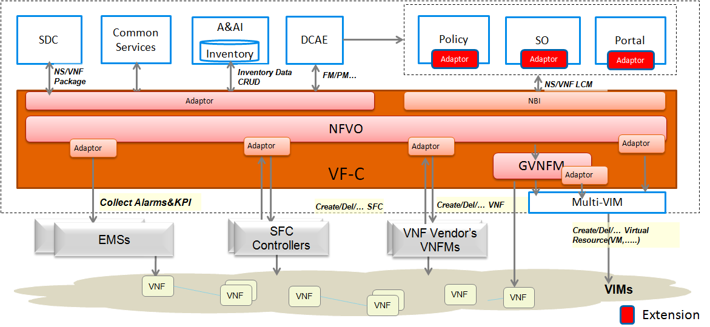

.. This work is licensed under a Creative Commons Attribution 4.0 International License.
.. http://creativecommons.org/licenses/by/4.0

VF-C Architecture
-----------------
Following is the VF-C architecture.

|image0|

   
   
VF-C as one controller in ONAP includes two components NFV-O and GVNFM. 

For NFV-O, it provides north bound interface to SO to take part in fulfilling the orchestration and operation of end2end service.and provides standard south bound interface to VNFMs. 

For GVNFM, it provides LCM for VNFs which do not require a vendor VNFM and works with NFV-O component to take part in fulfilling the LCM of NS.

In addition, VF-C provides interface to Policy and works with DCAE for Close Loop Automation.
   
As you can see in this picture,VF-C has many dependencies with other projects,such as SO,Policy,A&AI,SDC,DCAE,Multi-cloud and so on.