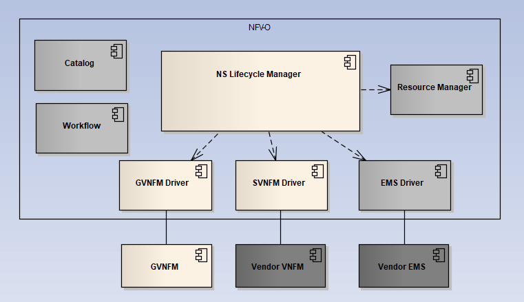

.. This work is licensed under a Creative Commons Attribution 4.0 International License.
.. http://creativecommons.org/licenses/by/4.0
.. _architecture:

VF-C Architecture
==================

.. contents::
   :depth: 2

VF-C Internal Component
-----------------------

|image0|

This shows all VF-C components, each component is a standalone microservice, these microservice including:

* nslcm is the core components, mainly responsible for network service management.
* catalog is used to package management, including NS/VNF/PNF package management.
* Resource Manager is used to manage the instance created by VF-C and also responsible for resource granting.
* SVNFM Driver, now VF-C has three vendor's Specific VNFM driver, including nokia/huawei/zte driver, each driver is a microservice.
* GVNFM Driver, now have two generic VNFM driver, including gvnfm driver and juju driver. 
* SFC Driver, it migrate from Open-O seed code and now haven't been used in any usecase in ONAP. 
* Wfengine-mgrservice, it provides the workflow management service, now it has been integrated with activiti workflow and provide the unified interface to external components.
* Wfengine-activiti, it is as the activiti work flow microservice.
* Multivim-proxy,provide the multivim indirect mode proxy which can forward virtual resource requests to multivim and do some resource checking.  
* EMS Driver, used for VNF performance and alarm data collection and report to DCAE VES collector.
* GVNFM, it includes three micorservice: vnflcm, vnfmgr and vnfres and the core is vnflcm which is responsible for VNF life cycle management.
* DB, provide database services for each VF-C component.  

Note:
  a. SFC Driver migrated from Open-O seed code and now haven't been used in any usecase in ONAP. 
  b. Resource Management is used to do the resource granting, but now VF-C has been integrated with OOF, this component will be deprecated in the future release.
  c. DB provides the stand-alone database microservice in casablanca release, but now VF-C leverages OOM shared MariaDB-Gelera cluster. This repo still has redis to be used by VF-C component. 

VF-C External Dependency
------------------------
  
|image1|

.. |image1| image:: vfc-dependence.png
   :width: 6.97047in
   :height: 4.63208in
   
As you can see in this picture, VF-C has many dependencies with other projects, such as SO, Policy, A&AI, SDC, DCAE, Multi-cloud and so on.

* NFVO provides north bound interface to SO to take part in fulfilling the orchestration and operation of end2end service and provides standard south bound interface to VNFMs. 

* GVNFM provides LCM for VNFs which do not require a vendor VNFM and works with NFV-O component to take part in fulfilling the LCM of NS.

* VF-C provides VNFM driver interfaces, vendor can implement these to integrate with VF-C. Now, VF-C has integrated with three vendor VNFM, including ZTE, Huawe, Nokia. 

* In addition, VF-C also provides interface to Policy and works with DCAE for Close Loop Automation.
   
* In Casablanca release, VF-C is also integrated with OOF to do the resource homing and placement.

VF-C Usecase and Workflow
-------------------------

VF-C support VoLTE use case, vCPE use case in last three release and will support CCVPN use case in Dublin release.

 - VoLTE usecase information can be found : https://wiki.onap.org/pages/viewpage.action?pageId=6593603
 - vCPE usecase information can be found : https://wiki.onap.org/pages/viewpage.action?pageId=3246168
 - CCVPN usecase information can be found : https://wiki.onap.org/pages/viewpage.action?pageId=45296665

Taking VoLTE as an example to describe the VF-C internal workflow:

1. VF-C Instantiate

|image2|

The workflow:

* 	SO send request to  LCM to deploy vIMS+vEPC network service. 
* 	LCM  talk with Resource Manager and then A&AI to create NS instances in A&AI inventory. 
* 	LCM get NSD from VF-C catalog. 
* 	LCM parse the NS model via TOSCA parser to decompose NS to VNFs and recognize the relationship between VNFs. 
* 	LCM init workflow context and execute NS instantiation. 
* 	Workflow will invoke LCM to instantiate VLs between VNFs. 
* 	LCM talk with Multi-VIM to create virtual network connections between VNFs if needed. 
* 	LCM talk with Resource manager to create related virtual link instances to A&AI inventory(Not included in R1). 
* 	When VL is created ,workflow will invoke LCM to instantiate VNFs. 
* 	LCM send request to S-VNFM Driver and work with  S-VNFM to deploy each VNFs. 
* 	Aligned with ETSI specs work flow, VNFM need to send granting resource request to LCM,LCM transfer this request to Resource manager and then response the granting result and related VIM information(such as url/username/password etc) to VNFM. 
* 	VNFM call VIM API to deploy VNF into VIM. 
* 	VNFM send notification to LCM to notify the changes of virtual resources, including VDU/VL/CP/VNFC etc. 
* 	LCM talk to Resource manager to create/update related records in A&AI inventory
   
2.VF-C Terminate

|image3|

   
The workflow:

*	SO talk with VF-C to request deletion of vIMS/vEPC network services 
*	Lcm work with Resource Manager to check all  vIMS/vEPC instances in A&AI 
*	LCM invoke workflow to delete NS instance 
*	First, workflow will execute deleting VNFs by invoking LCM 
*	LCM talk with S-VNFM Driver to request deletion of VNFs and related resources 
*	Aligned with ETSI specs work flow, VNFM will delete/release virtual resources with the granting to LCM 
*	LCM transfer the grant request to Resource Manager and then response the granting result and related VIM information(such as url/username/password etc) to VNFM. 
*	VNFM delete VNFs and related resources and  notify the changes(releasing) of virtual resources to LCM 
*	Lcm talk with Resource Manager to  update/delete related resource instances in A&AI inventory 
*	When above work finish, workflow  will delete VLs 
*	LCM talk with Multi-VIM to request deletion of virtual network connected to VNFs 
*	Multi-VIM delete related virtual network resources, such as network, sub-network and port etc. 
*	LCM talk with Resource Manager to update/delete related VL resource instances in A&AI inventory(Not included in R1) 
*       LCM talk with Resource Manager to update/delete related NS instances in A&AI inventory

3. VF-C Healing

|image4|

.. |image4| image:: vfc-heal.png
   :width: 6.97047in
   :height: 4.63208in
   
The workflow:

*	EMS Driver collects VNF service level FCAPS in real-time or period. 
*	EMS Driver will transfer VNF service level FCAPS metrics to DCAE with VES data format. 
*	Data filtering/cleaning inside DCAE, DCAE can send related events to data bus. Holmes can keep track of the events published to data bus and do the alarm correlation analysis based on the imported rules then Holmes send the result and root cause to the event bus. 
*	Policy engine subscribe related topic on event bus. After receiving auto-healing triggering events, matching the events with exist rules. 
*	Policy invoke VF-C APIs to do the action of auto-healing once matching events with healing rules. 
*	LCM talk with VNFM driver to restart VNF and receive the changes of virtual resources. 
*	LCM talk with Resource Manager to update/create related instance information to A&AI inventory according to the changes of resources. 

If you would like to know more details about vCPE, you can refer https://wiki.onap.org/display/DW/vCPE+with+Tosca+VNF+Test+Guide

 
