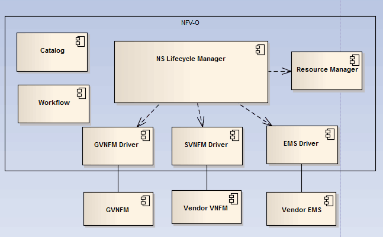

VF-C Delivery
-------------
VF-C includes the following components in R1.

|image0|

VF-C includes several components in ONAP R1.

* Workflow includes two micro service: workflow manage service and workflow-activity engine service, this two services will onboard workflow to workflow engine and parse workflow.

* For NS Lifecycle Manager,it mainly completes the NS lifecycle management,such as NS Instantiation/termination and auto-healing.  

* For Resource manager, it will communicate with NS lifecycle manager to update instance data to A&AI.

* In VF-C southbound, it includes Gvnfmdriver and SVNFM driver which will interact with GVNFM and Vendor VNFM respectively to execute VNF lifecycle management,VF-C provides vnfm driver northbound api,then vendor can implement this APIs to integrate with VF-C.

* For the EMS driver,it can collect VNF lay’s Fcaps data from Vendor EMS, and then translate and put these data to DCAE Vescollector

For the Amsterdam release, VF-C includes the following components:

NFVO
 - vfc-nfvo-lcm
 - vfc-nfvo-catalog
 - vfc-nfvo-resmgr
 - vfc-nfvo-driver-emsdriver
 - vfc-nfvo-driver-gvnfm-gvnfmadapter
 - vfc-nfvo-driver-gvnfm-jujudriver
 - vfc-nfvo-driver-svnfm-ztedriver
 - vfc-nfvo-driver-svnfm-huaweidriver
 - vfc-nfvo-driver-svnfm-nokiadriver
 - vfc-nfvo-driver-sfc-ztesfcdriver
GVNFM
 - vfc-gvnfm-vnflcm
 - vfc-gvnfm-vnfmgr
 - vfc-gvnfm-vnfres
Workflow
 - workflow-engine-mgr-service
 - activity-extension
 
Since the Guilin release,  VF-C includes the following components:

NFVO
 - vfc-nfvo-lcm
 - vfc-nfvo-driver-gvnfm-gvnfmadapter
 - vfc-nfvo-driver-svnfm-ztedriver
 - vfc-nfvo-driver-svnfm-huaweidriver
GVNFM
 - vfc-gvnfm-vnflcm
 - vfc-gvnfm-vnfmgr
 - vfc-gvnfm-vnfres
Deprecated components:
 - vfc-nfvo-catalog
 - vfc-nfvo-resmgr
 - vfc-nfvo-driver-emsdriver
 - vfc-nfvo-driver-gvnfm-jujudriver
 - vfc-nfvo-driver-svnfm-nokiadriver
 - vfc-nfvo-driver-sfc-ztesfcdriver
 - workflow-engine-mgr-service
 - activity-extension