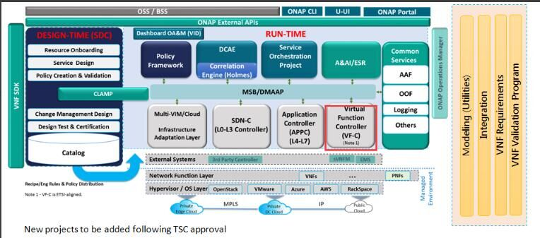
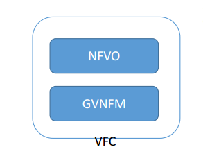

.. This work is licensed under a Creative Commons Attribution 4.0 International License.
.. http://creativecommons.org/licenses/by/4.0

.. _vfc_index:

ONAP VF-C
=========

|image0|

As part of the integration between OpenECOMP and OPEN-O, VF-C leverages ETSI NFV MANO architecture and information model as a reference, and implements life cycle management and FCAPS of VNF and NS.

* support NS and VNF lifecycle management based on the ONAP tosca and yang data model and workflow
* support integration with multi VNFMs via drivers, which include vendors VNFM and generic VNFM
* support integration with multi VNFs via generic VNFM, which does not provide VNFM function
* support integration with multi VIMS via Multi-VIM, which include the opensource and commercial VIMs
* support microservice architecture and model driven resource orchestration and management

|image1|

   
VF-C as one controller in ONAP includes two components NFV-O and GVNFM. 

* NFVO component

	* compliant with ETSI NFV MANO architecture and information model,
	* providing resource orchestration and full life cycle management and FCAPS for NS,
	* providing standard south bound interface to VNFMs,
	* providing north bound interface to SO, to take part in fulfilling the orchestration and operation of end2end service,
	* providing interface and work with DCAE and Policy for Close Loop Automation.

* GVNFM component

	* compliant with ETSI NFV MANO architecture and information model
	* providing full life cycle management and FCAPS for VNFs which do not require a vendor VNFM,
	* providing interface and work with NFV-O component, to take part in fulfilling the LCM and FCAPS management of NS,
	* providing interface and work with DCAE and Policy for Close Loop Automation.

.. toctree::
   :maxdepth: 2

   architecture.rst
   APIs/index
   consumedapis.rst
   delivery.rst
   logging.rst
   installation/index
   cli-userguide/index
   administration.rst
